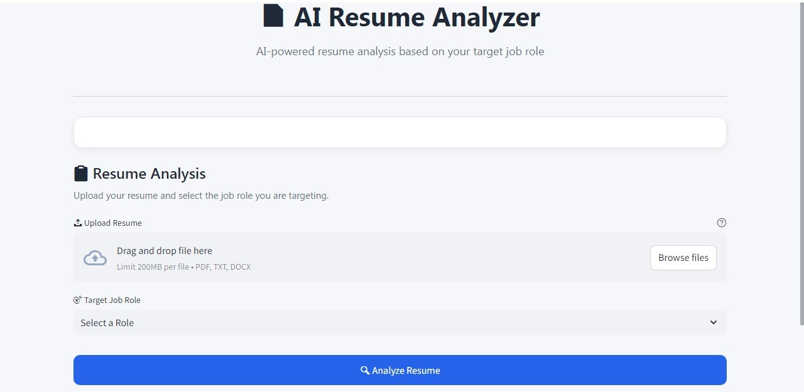
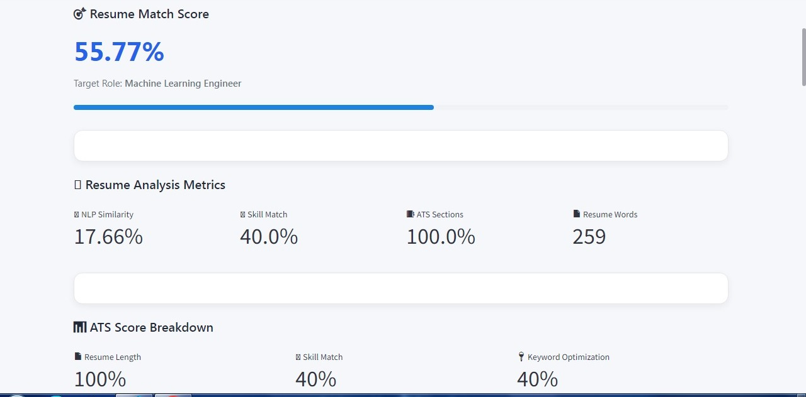
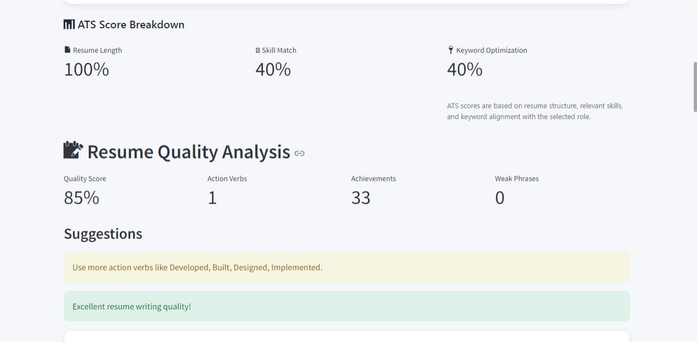
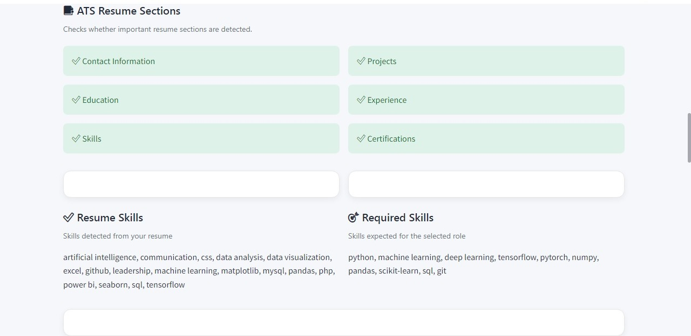
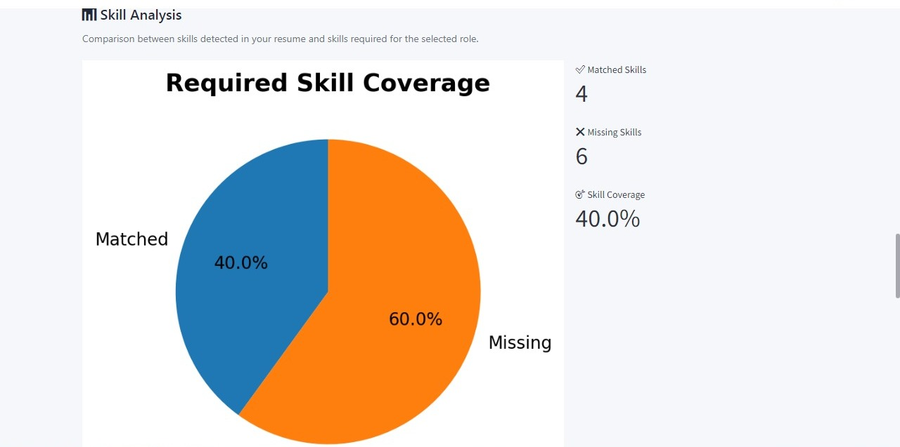
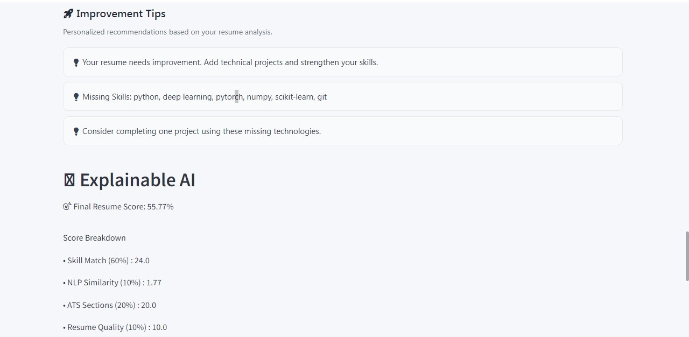
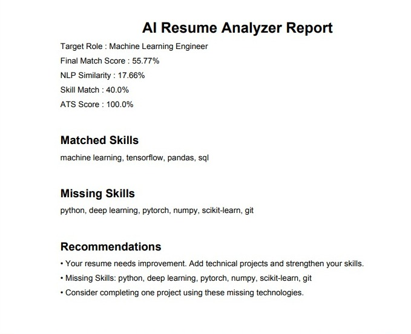

# 📄 AI Resume Analyzer

An AI-powered Resume Analyzer built with **Python** and **Streamlit** that evaluates resumes against a selected job role using **Natural Language Processing (NLP)**, **ATS analysis**, and **skill matching**.

## 🚀 Features

* 📄 Resume Parsing (PDF)
* 🎯 Role-Based Resume Analysis
* 🤖 NLP Semantic Similarity
* 🛠️ Skill Extraction & Matching
* 📊 Resume Match Score
* ✅ ATS Resume Section Checking
* 📈 Resume Quality Analysis
* 💡 Personalized Improvement Tips
* 🔍 Explainable AI (XAI) for Score Interpretation
* 📑 Professional PDF Analysis Report
* 🎨 Modern Streamlit User Interface

---

## 🛠️ Tech Stack

### Frontend

* Streamlit

### Backend

* Python

### Libraries

* PyPDF2
* scikit-learn
* matplotlib
* FPDF2
* Regular Expressions (re)

---

## 📂 Project Structure

```text
AI-Resume-Analyzer/
│
├── app.py
├── README.md
├── LICENSE
├── requirements.txt
│
├── assets/
│   └── screenshots/
│       ├── home.png
│       ├── analysis1.png
│       ├── analysis2.png
│       ├── analysis3.png
│       ├── analysis4.png
│       └── report.png
│
└── src/
    ├── __init__.py
    ├── config.py
    ├── resume_parser.py
    ├── similarity.py
    ├── skill_extractor.py
    ├── ats_checker.py
    ├── scoring.py
    ├── normalization.py
    ├── quality_analyzer.py
    ├── explainability.py
    ├── recommendations.py
    └── report_generator.py
```

---

## 📷 Application Screenshots

### Home Page



---

### Resume Analysis











---

### Generated PDF Report



---

## ⚙️ Installation

Clone the repository

```bash
git clone https://github.com/rani-parkhi/AI-Resume-Analyzer.git
```

Move into the project directory

```bash
cd AI-Resume-Analyzer
```

Install dependencies

```bash
pip install -r requirements.txt
```

Run the application

```bash
streamlit run app.py
```

---

## 📋 How It Works

1. Upload your resume (PDF).
2. Select your target job role.
3. Analyze the resume.
4. View:

   * Resume Match Score
   * NLP Similarity
   * Skill Match
   * ATS Section Analysis
   * Resume Quality
   * Explainable AI Insights
   * Improvement Tips
5. Download the analysis report as a PDF.

---

## 🎯 Future Improvements

* Support DOCX resumes
* Resume ranking for multiple resumes
* AI-generated resume improvement suggestions
* Cloud deployment
* Database integration
* Authentication and user history

---

## 👩‍💻 Author

**Rani Parkhi**

B.Tech AI & Data Science Student

GitHub: https://github.com/rani-parkhi

LinkedIn: https://www.linkedin.com/in/rani-parkhi-810a40379?utm_source=share_via&utm_content=profile&utm_medium=member_android

---

## 📄 License

This project is licensed under the MIT License.
